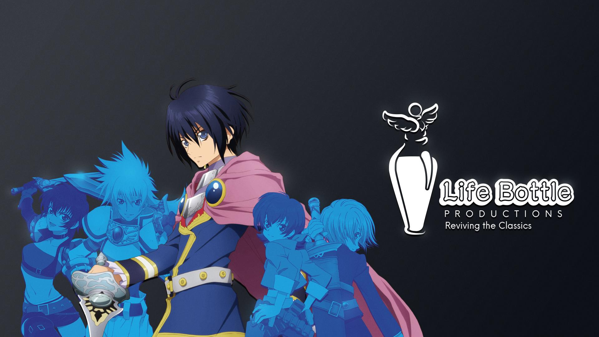

<head>
<meta property="og:title" content="Life Bottle - Reviving the Classics" /> <!-- clickable title link -->
<meta property="og:site_name" content="Life Bottle" /> <!-- Top line before clickable link giving a "site name" -->
<meta property="og:description" content="Volunteer group dedicated to the Tales franchise" /> <!-- page description -->
<meta name="theme-color" content="#f7f7f7" /><!-- small little colorbox vertical line on the side -->
<!-- PICK ONE -->
<!-- <meta property='og:video' content='https://www.youtube.com/v/yOZFyjv8s5g' /> -->  <!-- (youtube) one way to show a video -->
<!-- <meta property='og:url' content='https://www.youtube.com/watch?v=yOZFyjv8s5g' /> --> <!-- (youtube) the other way -->
<!-- <meta property='og:video' content='/img/stahn_falling_into_a_hole.mp4' /> --> <!-- the local way -->
<meta name="twitter:card" content="summary_large_image">
<meta name="twitter:image" content="https://lifebottle.github.io/assets/coverpage/img/coverxmas.jpg"> <!-- image preview -->
</head>
# **Life Bottle Productions**

# Reviving the Classics

> Happy Holidays!

[Join us on Discord](https://discord.com/invite/NUvvgUtdXW) <!--  Use ID of homepage heading i.e. based on H1 of README.md - make sure this is DIFFERENT to the cover's heading -->

